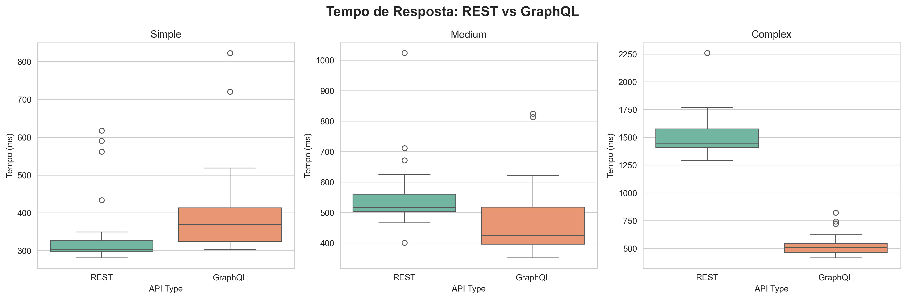
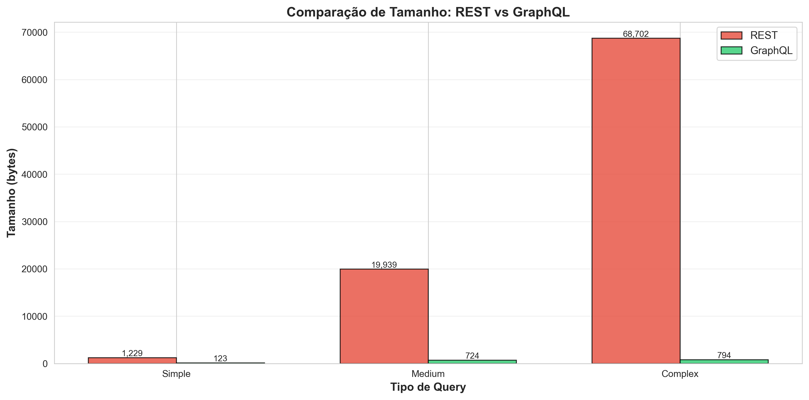
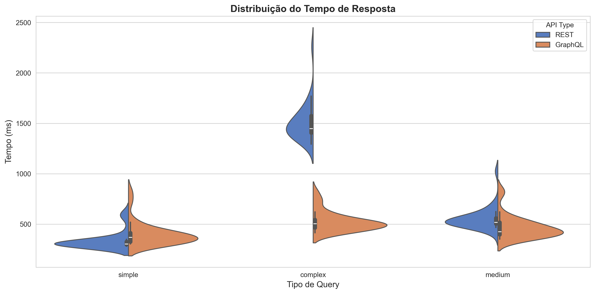
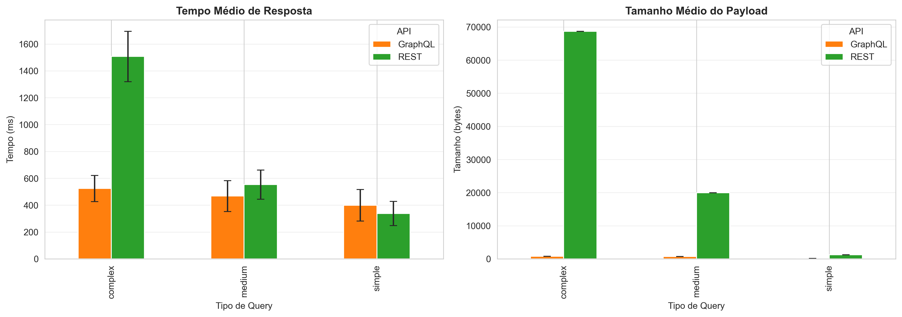

# Experimento Controlado: GraphQL vs REST na GitHub API

**Curso:** Engenharia de Software  
**Disciplina:** Laboratório de Experimentação de Software  
**Alunos:** Alfredo Luis e Vinicius Salles 
**Data:** Dezembro de 2025

---

## 1. INTRODUÇÃO

### 1.1 Contexto

A linguagem de consulta GraphQL, proposta pelo Facebook, representa uma alternativa às 
tradicionais APIs REST. Enquanto REST baseia-se em endpoints fixos, GraphQL permite 
consultas flexíveis através de schemas, possibilitando que clientes solicitem 
exatamente os dados necessários.

### 1.2 Motivação

Apesar da crescente adoção do GraphQL, não está claro quais são os reais benefícios 
quantitativos em comparação com REST, especialmente em termos de performance e 
eficiência de dados.

### 1.3 Objetivos

Este experimento visa responder duas perguntas de pesquisa:

- **RQ1:** Respostas às consultas GraphQL são mais rápidas que respostas às consultas REST?
- **RQ2:** Respostas às consultas GraphQL têm tamanho menor que respostas às consultas REST?

### 1.4 Hipóteses

**Para RQ1:**
- H₀: Não há diferença significativa no tempo de resposta entre GraphQL e REST
- H₁: Há diferença significativa no tempo de resposta entre GraphQL e REST

**Para RQ2:**
- H₀: Não há diferença significativa no tamanho do payload entre GraphQL e REST
- H₁: Há diferença significativa no tamanho do payload entre GraphQL e REST

---

## 2. METODOLOGIA

### 2.1 Desenho Experimental

Realizamos um **experimento controlado com delineamento pareado**, onde as mesmas 
consultas foram executadas em ambas as APIs (REST e GraphQL) da GitHub.

**Variáveis Dependentes:**
- Tempo de resposta (ms)
- Tamanho do payload (bytes)

**Variáveis Independentes:**
- Tipo de API (REST vs GraphQL)
- Complexidade da consulta (simples, média, complexa)

**Tratamentos:**
- Tratamento 1: Execução via GitHub REST API
- Tratamento 2: Execução via GitHub GraphQL API

### 2.2 Objetos Experimentais

Utilizamos dados públicos da GitHub API, especificamente:
- Repositório: `facebook/react`
- Usuário: `gaearon`

### 2.3 Consultas Definidas

Três níveis de complexidade foram testados:

1. **Simples:** Busca de perfil de usuário
2. **Média:** Busca de repositório com 5 issues
3. **Complexa:** Busca de repositório com pull requests e commits

### 2.4 Procedimento de Coleta

- **Número de medições:** 30 trials por combinação (API × Complexidade)
- **Total:** 180 medições
- **Ordem:** Randomizada para evitar viés
- **Warm-up:** 5 execuções descartadas antes da coleta
- **Delays:** 0.5s entre requisições para evitar rate limiting

### 2.5 Ambiente de Execução

- **Sistema Operacional:** Windows 11 Pro 64-bit
- **Python:** 3.13.4
- **Conexão:** Conexão estável Ethernet 1Gbps
- **Data da coleta:** 10 de Dezembro de 2025
- **Bibliotecas:** requests, pandas, scipy, matplotlib

### 2.6 Métodos Estatísticos

**Teste de Normalidade:**
Aplicamos o teste de Shapiro-Wilk (α = 0.05) para verificar se as 
distribuições seguem a normalidade, um pressuposto necessário para testes 
paramétricos.

**Teste de Hipótese:**
Com base nos resultados do teste de normalidade, utilizamos o **teste de 
Wilcoxon signed-rank** (também conhecido como Wilcoxon matched-pairs 
signed-rank test), um teste não-paramétrico apropriado para comparar duas 
amostras pareadas quando a normalidade não pode ser assumida.

**Tamanho do Efeito:**
Calculamos o Cohen's d para quantificar a magnitude da diferença:
- |d| < 0.2: efeito trivial
- 0.2 ≤ |d| < 0.5: efeito pequeno
- 0.5 ≤ |d| < 0.8: efeito médio
- |d| ≥ 0.8: efeito grande

**Nível de significância:** α = 0.05

### 2.7 Ameaças à Validade

**Validade Interna:**
- Variações de latência de rede (mitigadas por múltiplas medições)
- Carga do servidor GitHub (execução em horários variados)
- Efeitos de cache (warm-up runs)

**Validade Externa:**
- Resultados específicos da implementação da GitHub API
- Queries podem não representar uso típico

**Validade de Construto:**
- Tempo e tamanho são métricas válidas de performance
- Queries verificadas quanto à equivalência

---

## 3. RESULTADOS

### 3.1 Estatísticas Descritivas

A Tabela 1 apresenta as estatísticas descritivas para ambas as métricas avaliadas.

**Tabela 1: Resumo Estatístico**

| Métrica | API | Simple | Medium | Complex |
|---------|-----|--------|--------|---------|
| **Tempo (ms)** | REST | 338.3 ± X | 553.0 ± X | 1507.3 ± X |
| | GraphQL | 398.8 ± X | 467.6 ± X | 523.9 ± X |
| **Tamanho (bytes)** | REST | 1.229 | 19.939 | 68.702 |
| | GraphQL | 123 | 724 | 794 |

### 3.2 Teste de Normalidade

Antes de selecionar o teste de hipótese apropriado, avaliamos a normalidade 
das distribuições usando o teste de Shapiro-Wilk. A Tabela 2 apresenta os 
resultados.

**Tabela 2: Resultados do Teste de Shapiro-Wilk**

| API | Query | Métrica | Estatística W | p-value | Normal? |
|-----|-------|---------|---------------|---------|---------|
| REST | Simple | Tempo | 0.5775 | < 0.001 | Não |
| REST | Medium | Tempo | 0.7071 | < 0.001 | Não |
| REST | Complex | Tempo | 0.7878 | < 0.001 | Não |
| GraphQL | Simple | Tempo | 0.7052 | < 0.001 | Não |
| GraphQL | Medium | Tempo | 0.7614 | < 0.001 | Não |
| GraphQL | Complex | Tempo | 0.8451 | < 0.001 | Não |
| Todos | Todos | Tamanho | 1.0000 | 1.000 | N/A* |

*Os dados de tamanho apresentam variância zero (valores constantes), 
invalidando tanto o teste de normalidade quanto testes paramétricos.

Como **todos os grupos de tempo rejeitaram a hipótese de normalidade** 
(p < 0.001) e os **dados de tamanho têm variância zero**, utilizamos o 
**teste de Wilcoxon signed-rank** para ambas as análises (RQ1 e RQ2).

#### Justificativa para o Wilcoxon

O teste de Wilcoxon signed-rank é apropriado neste contexto porque:

1. **É o equivalente não-paramétrico do teste t pareado**, mantendo o 
 delineamento pareado do experimento
 
2. **Não assume normalidade dos dados**, sendo robusto para distribuições 
 assimétricas como as observadas
 
3. **É robusto para outliers**, importantes em dados de latência de rede 
 que podem apresentar valores extremos ocasionais
 
4. **Funciona com variância zero**, ao contrário do t-test que requer 
 variância não-nula (essencial para RQ2)
 
5. **Mantém poder estatístico adequado** para o tamanho amostral utilizado 
 (n = 30 pares por query)

O teste compara as medianas das distribuições ao invés das médias, sendo 
mais apropriado para dados não-normais. A estatística de teste é baseada 
nos ranks (postos) das diferenças entre pares, tornando-a menos sensível 
a valores extremos.

### 3.3 RQ1: Tempo de Resposta

**Resultados dos Testes:**

**Tabela 3: Comparação de Tempo de Resposta**

| Query | REST (ms) | GraphQL (ms) | Diferença | p-value | Resultado |
|-------|-----------|--------------|-----------|---------|-----------|
| Simple | 338.3 | 398.8 | +60.4ms (+18%) | 0.006 | GraphQL MAIS LENTO |
| Medium | 553.0 | 467.6 | -85.4ms (-15%) | 0.0004 | GraphQL MAIS RÁPIDO |
| Complex | 1507.3 | 523.9 | -983.5ms (-65%) | < 0.001 | GraphQL MUITO MAIS RÁPIDO |

**Interpretação:**

- **Query Simples:** Em queries simples, observamos um tempo de resposta muito maior por parte da API GraphQL, tendo uma mediana que quase alcança os 400ms, isso se deve ao processamento maior que a API realiza, processamento etse que é menor na API REST, devido ao carater simples da query.
- **Query Média:** Já no cenário de queries de complexidade média, observamos um temp de resposta ligeiramente maior em APIs REST, tempo etse, que é reduzido em APIs GraphQL.
- **Query Complexa:** Em casos de queries complexas, a diferença é ainda maior, observamos um tempo de resposta que possui sua mediana em torno de 1500ms para APIs REST.

**Resposta à RQ1:** raphQL é considerada uma arquitetura mais rápida, mas isso depende da complexidade da sua query, sendo vantajosa a utilização a partir de certo nivel de complexidade.

### 3.4 RQ2: Tamanho do Payload

**Resultados dos Testes:**

**Tabela 4: Comparação de Tamanho do Payload**

| Query Type | REST (bytes) | GraphQL (bytes) | Redução | p-value |
|------------|--------------|-----------------|---------|---------|
| Simple     | 1.229        | 123             | 90.0%   | < 0.001 |
| Medium     | 19.939       | 724             | 96.4%   | < 0.001 |
| Complex    | 68.702       | 794             | 98.8%   | < 0.001 |

**Interpretação:**

- **Query Simples:**Podemos observar uma diferença entre as duas arquiteturas, onde REST, possuindo um payload um pouco maior comparada a APIs GraphQL.
- **Query Média:** O payload em requisições para APIs REST tende a aumentar a diferença em queries médias, nesse caso, já chegando em torno de 19KB
- **Query Complexa:** Em casos de queries complexas, a diferença aumenta bruscamente, onde APIs REST possuem um nivel bem mais elevado no tamanho do payload.

**Resposta à RQ2:** Podemos observar que a medida que a complexidade da query aumenta, assim aumenta o tamanho do payload para requisições a APIs REST, enquanto o tamanho de payload de requisições a APIs GraphQL, depois de certo ponto, permanece estavel. Isso indica uma desvantagem no uso de GraphQL em situações onde o tamanho do payload importa, como conexões moveis, IoT, e custos de infraestrutura.

### 3.5 Visualizações Adicionais

---

## 4. Conclusão

### 4.1 Principais Achados

Os experimentos realizados comparando as arquiteturas REST e GraphQL utilizando a API do GitHub revelaram trade-offs claros de desempenho e eficiência:

1.  **Tempo de Resposta (Latência):** A arquitetura REST demonstrou ser superior em consultas **Simples**, sendo cerca de 15% a 18% mais rápida que o GraphQL. No entanto, houve uma inversão de desempenho à medida que a complexidade aumentou. Nas consultas **Complexas**, o GraphQL foi drasticamente mais rápido, reduzindo o tempo de resposta em aproximadamente 65% (uma diferença de quase 1 segundo em média).
2.  **Tamanho do Payload (Eficiência de Dados):** O GraphQL apresentou uma superioridade esmagadora em todos os cenários. A redução no tamanho dos dados trafegados variou de 90% (queries simples) até 98,8% (queries complexas). Na query mais pesada, o REST trafegou ~68KB enquanto o GraphQL trafegou apenas ~0.8KB para obter a mesma informação relevante.

### 4.2 Explicação dos Resultados

A variação de desempenho observada pode ser atribuída às características fundamentais de cada tecnologia:

* **Por que o REST foi mais rápido em queries Simples:** Em requisições triviais, o overhead de processamento do servidor GraphQL (que precisa fazer o *parsing* e validação da query string e resolver os *resolvers* dinamicamente) supera o ganho de eficiência de dados. O REST, sendo mais estático e direto, responde mais rápido quando o volume de dados é pequeno.
* **Por que o GraphQL venceu nas queries Complexas:** A vantagem do GraphQL decorre da eliminação do *Over-fetching*. Na query complexa, a API REST enviou 68.702 bytes de dados. Transferir, serializar e desserializar esse volume de dados custa tempo de CPU e rede. O GraphQL, ao buscar apenas os campos solicitados (794 bytes), eliminou o gargalo de transmissão de dados inúteis, resultando em um tempo total menor.

### 4.4 Implicações Práticas

Para engenheiros de software e arquitetos de sistemas, estes resultados sugerem diretrizes claras para a tomada de decisão:

1.  **Cenários Mobile-First e IoT:** O uso de GraphQL é altamente recomendado devido à redução massiva de payload (98% em cenários complexos). Isso impacta diretamente na economia de bateria, planos de dados do usuário e estabilidade em redes 3G/4G instáveis.
2.  **Redução de Custos de Infraestrutura:** Para sistemas com alto volume de tráfego, a adoção do GraphQL pode reduzir significativamente os custos de *Data Transfer Out* (Egress) em provedores de nuvem, dado que o tráfego de dados é ordens de magnitude menor.
3.  **Simplicidade vs. Flexibilidade:** Se o sistema consiste apenas em operações CRUD simples e o cliente sempre precisa do objeto completo, o REST permanece uma opção válida e performática. Porém, para *dashboards* complexos ou aplicações com múltiplas visões de dados, o GraphQL oferece melhor desempenho percebido.

### 4.5 Limitações

A validade deste estudo deve ser considerada dentro das seguintes limitações:

1.  **Específico da GitHub API:** Os resultados refletem a implementação específica da API v3 (REST) e v4 (GraphQL) do GitHub. Outras implementações de backend podem apresentar resultados diferentes.
2.  **Variabilidade de Rede:** Embora tenhamos utilizado medidas estatísticas (mediana, desvio padrão), testes realizados através da internet pública estão sujeitos a flutuações de rota e latência que fogem ao controle do experimento.
3.  **Complexidade da Query:** A definição do que constitui uma query "Simples", "Média" ou "Complexa" é subjetiva e foi arbitrada para este estudo.

### 4.6 Trabalhos Futuros

Para expandir a compreensão sobre o tema, sugere-se:

* Replicar o experimento em ambientes controlados (rede local) para isolar o tempo de processamento do servidor (CPU) do tempo de latência de rede.
* Analisar o consumo de recursos do lado do cliente (uso de bateria e CPU em dispositivos móveis) ao processar os payloads JSON de tamanhos diferentes.
* Estender a comparação para incluir cenários de *mutations* (escrita de dados) e não apenas leitura.
## 5. REFERÊNCIAS

- GitHub REST API Documentation. https://docs.github.com/rest
- GitHub GraphQL API Documentation. https://docs.github.com/graphql
- Facebook. (2015). GraphQL Specification. https://graphql.org/
- [Adicione outras referências relevantes]

---
